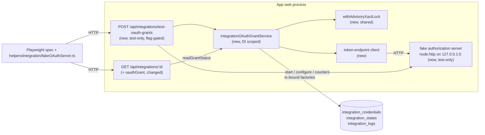

# OAuth2 Grant Lifecycle — Phase 1 Core (feature spec)

> **Parent:** [App Spec: OAuth2 Grant Lifecycle for Integrations](2026-09-27-app-spec-oauth2-grant-lifecycle.md), the single source of truth. This spec does **not** restate it. The App Spec owns, and wins on any conflict about: business context, the ubiquitous language (§1.3), the entities and grant-blob fields (§1.4.2), invariants I1–I7, the descriptor fields (§1.4.3), signals and log levels (§1.4.4), the failure contract (§1.4.5), the workflows, the acceptance criteria (§7), BC classification (§10.1) and rejected alternatives (§11). Commit plan: [`app-spec-notes/commits-oauth2-core.md`](app-spec-notes/commits-oauth2-core.md).
>
> **Status:** Approved for implementation. **Baseline:** `develop` @ `4bdabd8bb`. The surfaces the App Spec cites in `integrations`, `communication_channels` and `shared` have not drifted since its baseline `67605e74f`.

## TLDR

**Key points:**
- This is the implementation contract for App Spec Phase 1: one PR, 10 commits (P1–P6, with P4 split into P4a–P4e).
- It fixes what the App Spec left open:
  - the exact TypeScript API of `withAdvisoryXactLock`, the token-endpoint client, `credentialsService.erase` and `integrationOAuthGrantService`;
  - the test harness: fake authorization server, flag-gated test-only route, fault injection, dedicated small pool;
  - the P4 split;
  - risks, coverage and compliance.

**Scope:** P1 lock helper (shared) · P2 token client + RFC 7009 revoke · P3 `erase` + explicit `CredentialsService` type · P4 grant service + fake authorization server + test-only route · P5 flag projection, `upsert` fix, `oauthGrant` field, banner · P6 docs.

**Concerns:**
- **Q3 sign-off is needed before merge.** The new contract surfaces listed in App Spec §10.1 need maintainer sign-off (App Spec Q3, BLOCKER for merge, not for implementation).
- **The PR also touches `packages/cli`.** It adds one test-harness env flag to `packages/cli/src/lib/testing/integration.ts`. That change is test-only.

## Overview

The App Spec's §0 explains why the platform should own the grant lifecycle, and its §1.4.1 describes what exists today. This document covers how the Phase 1 code is shaped and how each acceptance criterion is proven. Out of scope, unchanged from the App Spec:
- Xero;
- the Gmail/MS365 hub;
- generic Connect routes and UI;
- rendering the `oauth` field type;
- events, notifications and every other Phase 3 item.

> **Market reference:** `axa-group/oauth2-mock-server` (Node), `navikt/mock-oauth2-server` and WireMock all fake an OAuth authorization server as a **real HTTP server**. The system under test reaches it **by URL**, and tests drive it through a **control plane** (hooks or an admin API with request counters). The harness below adopts that shape. It rejects `fetch` interception, because the code under test must exercise real HTTP, timeouts and connection handling.

## Problem Statement

The App Spec deliberately leaves four things to the feature spec. Its §7 says: *"The detailed test design belongs to the feature spec"*. The four things are:
1. the concrete TS contracts of the new and changed server surfaces;
2. how the database-bound criteria (I1–I7, forced refresh, reconnect in place, outer-transaction rollback, banner) run against real Postgres;
3. the five-commit split of P4;
4. the risk register and per-path coverage.

There is also no precedent in the repo for these tests:
- no Playwright spec exercises an OAuth round trip;
- the Gmail specs check only route wiring;
- several channel specs are `test.skip` with the reason *"provider mock seams are process-local"* (`TC-CHANNEL-EMAIL-028.spec.ts:18`, `TC-CHANNEL-EMAIL-C05.spec.ts:24`).

The harness design is therefore new ground and must be explicit.

## Proposed Solution

### Design decisions

| Decision | Rationale |
|---|---|
| **One feature spec, one PR, 10 commits.** | This is the App Spec's Phase 1 unit. The P1 helper has no consumer outside P4 in this change. |
| **The fake authorization server runs inside the app's web process.** A flag-gated test-only route starts it and is its control plane. The server implementation lives in `integrations/lib/oauth/testing/`. `helpers/integration/fakeOAuthServer.ts` is the Playwright harness that drives it over that route. Jest starts the same server in-process. | This is the dominant OM pattern for third-party doubles: a flag-gated fake inside the app, observed through a channel the test can read. Examples: `communication_channels/lib/test-seed.ts` + `api/post/test-seed`, which is read through a test-only route. `push_notifications/lib/fake-provider-recorder.ts` + `helpers/integration/pushFake.ts`, which is read through a JSONL file because the adapter may run in any process. No precedent exists for the app server calling a server hosted in the Playwright process. This design works whatever the topology: ephemeral harness, `yarn dev`, or an app container. The route never accepts a URL from the request, because it builds the descriptor from the server it started. A single implementation serves both Jest and Playwright. The App Spec names `helpers/integration/fakeOAuthServer.ts` as the fixture itself. Here that file becomes the harness, and the server moves to `lib/oauth/testing/` so module code never imports from `helpers`. |
| **`lib/oauth/testing/**` is `@internal`, not a contract surface.** | Only `token-endpoint`, `types`, `classification` and `grant-service` under `@open-mercato/core/modules/integrations/lib/oauth/*` become STABLE (App Spec Q3). Every `testing/` file carries an `@internal` JSDoc header, and `integrations/AGENTS.md` says the same. Provider packages reuse `startFakeAuthorizationServer` in Jest. How a provider reuses the harness in Playwright (its own descriptor needs a test-time endpoint seam) is decided by the first provider spec (Xero, Phase 2). |
| **New dedicated flag `OM_ENABLE_TEST_OAUTH_GRANTS`, owned by `integrations`.** | Every OM module owns its test flag; no module has ever reused another module's flag (`OM_ENABLE_TEST_CHANNEL_SEEDING`, `OM_ENABLE_PUSH_STUB_ADAPTER`, `OM_PUSH_FAKE_PROVIDERS`). The broad switches are unsafe as route gates: `OM_TEST_MODE` already returns OTP codes in responses (`OtpEmailProvider.ts:162`), and `.env.example` tells developers to set `OM_INTEGRATION_TEST` on long-lived dev servers (`packages/create-app/template/.env.example:231-235`). |
| **The flag goes into both env blocks of the CLI integration harness.** It does not go into `ci.yml`, `.env.example` or `test-env.env`, and specs skip when the flag is off. | CI shards run through the harness (`ci.yml:976-978`), and the push flags reach CI that way without being in `ci.yml`. Test gates are deliberately kept out of `.env.example`, and nothing reads `.ai/qa/test-env.env`. The standalone lanes (`snapshot.yml`, `npm-snapshot-preview.yml`, `scripts/test-create-app-integration.ts`) don't use the harness: the specs skip there through a 404 probe. These are platform-internal tests, not app behaviour. |
| **Playwright suites land with the code they verify** (P4b–P5). P4e holds only the cross-cutting suites. | Every commit verifies itself and the history stays bisectable. |
| **P4 order: connect and read → refresh → disconnect → cross-cutting.** This refines the suggested order (read → refresh → connect/disconnect). | A read-path suite needs a grant to read, and `completeConnect` is the only legitimate writer of a first grant. Seeding a grant through a test backdoor would bypass the very serialization under test. |
| **The flag projection, the `upsert` defaults fix and the post-commit `integrations.state.updated` all land together in P5.** P4 writes grant status only. | Projecting in P4 through today's `upsert` would, for one commit, create missing state rows with `isEnabled: false`, the bug P5 fixes (`state-service.ts:106`). Landing them together keeps every commit safe. In the commit plan, "same commit" means the same **DB transaction**, which P5 honours. |

### Alternatives considered

| Alternative | Why rejected |
|---|---|
| Fake authorization server in the Playwright process, reached by the app over loopback | No precedent. The test route would have to accept an endpoint URL in the request. It breaks when the app runs in a container. |
| Fake authorization server as the app's own routes (self-request, like the webhooks `mock_inbound` target) | Jest would need a second implementation. A "hang for 10 s" token endpoint would tie up a Next request handler. |
| Reusing `OM_ENABLE_TEST_CHANNEL_SEEDING` / `OM_TEST_MODE` / `OM_INTEGRATION_TEST` | See the flag decision above. |

## Architecture



The grant service is the only component that writes grant rows. The test route only drives it, and the fake server only answers protocol calls. Nothing existing calls the new service.

### File map

| File | Action | Commit |
|---|---|---|
| `packages/shared/src/lib/db/advisoryLock.ts` (+ `__tests__/advisoryLock.test.ts`) | Create | P1 |
| `packages/shared/package.json` (`exports["./lib/db/advisoryLock"]`) · `packages/shared/AGENTS.md` (`db/` row) | Modify | P1 |
| `packages/core/src/modules/integrations/lib/oauth/token-endpoint.ts` (+ tests) | Create | P2 |
| `packages/core/src/modules/integrations/lib/credentials-service.ts` (`erase`, explicit `CredentialsService`) (+ tests) | Modify | P3 |
| `integrations/lib/oauth/{types,grant-blob,classification,lock-key}.ts` | Create | P4a/P4b |
| `integrations/lib/oauth/testing/{fake-authorization-server,test-flag,test-integration,test-route-handlers,dedicated-orm}.ts` | Create | P4a–P4c |
| `integrations/api/post/test-oauth-grants/route.ts` | Create | P4a |
| `integrations/lib/oauth/grant-service.ts` · `integrations/di.ts` (`integrationOAuthGrantService`) | Create / Modify | P4b |
| `packages/cli/src/lib/testing/integration.ts` (both env blocks) | Modify | P4a |
| `packages/core/src/helpers/integration/fakeOAuthServer.ts` | Create | P4a |
| `integrations/__integration__/TC-INT-OAUTH-00{1..8}-*.spec.ts` | Create | P4a–P5 |
| `integrations/lib/oauth/__tests__/client-boundary.test.ts` (decoupling) | Create | P4e |
| `integrations/lib/state-service.ts` (`upsert` defaults) · `api/[id]/route.ts` (+ `openApi`) | Modify | P5 |
| `integrations/backend/integrations/[id]/page.tsx` · `.../components/OAuthGrantReauthBanner.tsx` · `i18n/{en,pl,de,es,ko}.json` | Modify / Create | P5 |
| `integrations/AGENTS.md` ("OAuth grants") · `apps/docs/docs/framework/modules/integrations-oauth-grants.mdx` · `apps/docs/sidebars.ts` | Modify / Create | P6 |

## Data Models

There is no schema change and no migration.

**The grant row** is described in App Spec §1.4.2: `integration_credentials`, `integration_id = '<integrationId>__oauth_grant'`, `user_id IS NULL`, an encrypted blob written through the credentials service.

**The blob** is validated at every read and write by `oauthGrantBlobSchema` (zod, `lib/oauth/grant-blob.ts`). Its fields are exactly those in §1.4.2, with this encoding:
- `version: 1`;
- datetimes as ISO-8601 UTC strings;
- `grantedScopes: string[]`;
- `providerData: Record<string, unknown> | null`.

Handling of unexpected values:
- **Unknown keys:** stripped.
- **Unparseable blob:** `platform_unavailable` (§1.4.5).

The type is `OAuthGrantBlob = z.infer<typeof oauthGrantBlobSchema>`.

## API Contracts

Everything below is server-only. No `.tsx` may import `integrations/lib/oauth/**`; the P4e test enforces this.

### P1: `@open-mercato/shared/lib/db/advisoryLock`

```ts
import type { EntityManager } from '@mikro-orm/postgresql'

export type AdvisoryLockWaitOutcome<T> = { resolved: true; value: T } | { resolved: false }

export type AdvisoryLockOptions<T> = {
  /** Total time a waiter may spend before giving up. Default 15_000. */
  waitDeadlineMs?: number
  /** One non-blocking attempt; throws `AdvisoryLockUnavailableError('busy')` if not acquired. */
  tryOnce?: boolean
  /** Called after each failed attempt, with no connection held; may short-circuit the wait. */
  onWait?: () => Promise<AdvisoryLockWaitOutcome<T>>
  /** Jittered exponential back-off bounds. Default { initialMs: 50, maxMs: 1000 }. */
  backoff?: { initialMs?: number; maxMs?: number }
}

export type AdvisoryLockUnavailableReason = 'busy' | 'deadline' | 'lock_timeout' | 'statement_timeout' | 'transient_db'

export class AdvisoryLockUnavailableError extends Error {
  readonly reason: AdvisoryLockUnavailableReason
  readonly key: string
}

/** `<namespace>:<parts>`; namespace `^[a-z][a-z0-9_]*$`, parts non-empty. */
export function assertNamespacedLockKey(key: string): void

/**
 * Runs `fn` inside one transaction that holds `pg_try_advisory_xact_lock(hashtextextended(key, 0))`.
 * - Always on `em.fork({ clear: true, freshEventManager: true, useContext: false })`: never nested in,
 *   or a savepoint of, a caller's transaction; commits on its own connection.
 * - Not acquired: the attempt's transaction ends (connection released), back-off, `onWait`, retry.
 * - `fn` MUST do all DB I/O on `txEm`, and MUST be bounded (≤ one external call).
 * - Errors from the helper's own DB work (begin, the lock query, commit) are mapped:
 *   SQLSTATE 55P03 → 'lock_timeout', 57014 → 'statement_timeout', `isTransientDbError` → 'transient_db'.
 * - Errors thrown by `fn` or `onWait` propagate unchanged; a throw from `fn` rolls back and releases.
 *   Callers map SQLSTATEs raised inside `fn` themselves.
 * - `txEm` has a fresh event manager: request-registered subscribers (tenant encryption) are absent.
 */
export function withAdvisoryXactLock<T>(
  em: EntityManager,
  key: string,
  fn: (txEm: EntityManager) => Promise<T>,
  options?: AdvisoryLockOptions<T>,
): Promise<T>
```

### P2: `@open-mercato/core/modules/integrations/lib/oauth/token-endpoint`

```ts
export type OAuthClientAuthMethod = 'client_secret_basic' | 'client_secret_post'
export type OAuthClientCredentials = { clientId: string; clientSecret: string; authMethod: OAuthClientAuthMethod }

/** Validated at the boundary: `access_token` required; `token_type` compared case-insensitively to 'bearer'. */
export type OAuthTokenResponse = {
  accessToken: string
  tokenType: 'Bearer'
  expiresInSec: number | null
  refreshToken: string | null
  scope: string[] | null
}

export type OAuthTokenEndpointErrorKind = 'protocol' | 'network' | 'timeout' | 'invalid_response'

/** `protocol` = RFC 6749 §5.2 error body parsed; `invalid_response` = non-JSON, wrong shape, or non-2xx without an error body. */
export class OAuthTokenEndpointError extends Error {
  readonly kind: OAuthTokenEndpointErrorKind
  readonly status: number | null
  readonly error: string | null
  readonly errorDescription: string | null
}

/** Form POST; `client_secret_basic` form-urlencodes id and secret before base64 (RFC 6749 §2.3.1). Default timeout 10_000 ms. */
export function requestTokenEndpoint(input: {
  url: string
  client: OAuthClientCredentials
  params: Record<string, string>
  timeoutMs?: number
}): Promise<OAuthTokenResponse>

/** RFC 7009. HTTP 200 is success, including for an unknown token. */
export function revokeToken(input: {
  url: string
  client: OAuthClientCredentials
  token: string
  tokenTypeHint?: 'refresh_token' | 'access_token'
  timeoutMs?: number
}): Promise<void>
```

Endpoints are code constants, so the client uses `fetch` with `AbortSignal.timeout` (App Spec §1.4.3). Error messages and `cause` never contain request bodies, so a secret cannot leak into an error report.

### P3: `integrationCredentialsService.erase`

```ts
type CredentialsServiceFactoryResult = ReturnType<typeof createCredentialsService>

/** Every existing member, unchanged; `erase` optional so DI overrides and test doubles keep compiling. */
export type CredentialsService = Omit<CredentialsServiceFactoryResult, 'erase'> & {
  /** Strict row (no bundle or user→tenant fallthrough). `credentials = {}`, then `deletedAt = now()`, flushed on the service's em. Returns false when no live row exists. */
  erase?(integrationId: string, scope: IntegrationScope): Promise<boolean>
}
```

- **Type-level guard** (`credentials-service.types.test.ts`), with three assertions:
  - the factory result is assignable to `CredentialsService`;
  - `Exclude<keyof CredentialsServiceFactoryResult, keyof CredentialsService>` is `never`, so the exported type can never drift narrower (it keeps `getSchema` and `saveField`'s `Promise<Record<string, unknown>>`);
  - `erase` is required on the factory result.
- **`erase` needs no DEK.**
  - It locates the row with `buildCredentialsFilter` and reads only `id`, never the encrypted `credentials` field. It is a deliberate low-level read, commented inline per the decryption-aware-reads lesson, so a missing DEK can't block erasure.
  - It writes the `{}` blob without `ensureCredentialsEncryptionMap` or a DEK.
- **Unit tests** cover encryption enabled, `TENANT_DATA_ENCRYPTION` disabled, and the DEK unavailable (the KMS returns no key).

### P4: `integrationOAuthGrantService`

```ts
export type OAuthGrantOwner = { tenantId: string; organizationId: string; userId?: null }

export type OAuthProviderDescriptor = {
  integrationId: string
  authorizationEndpoint: string
  tokenEndpoint: string
  revocationEndpoint?: string
  clientAuthMethod?: OAuthClientAuthMethod   // default 'client_secret_basic'
  pkce?: 'S256' | 'none'                      // default 'S256' (used by provider routes; Phase 2)
  defaultScopes: readonly string[]
  extraAuthorizeParams?: Readonly<Record<string, string>>
  defaultAccessTokenTtlSec?: number           // default 3600
  refreshSkewMs?: number                      // default 120_000
  revokePreviousOnReconnect?: boolean         // default false
  onAfterDisconnect?: (input: {
    grant: CapturedOAuthGrant
    owner: OAuthGrantOwner
    /** One refresh with the captured refresh token; not persisted. The core records the returned refresh token and revokes the most recent one, even if the hook throws afterwards. */
    refresh: () => Promise<OAuthTokenResponse>
  }) => Promise<void>
}

export type CapturedOAuthGrant = Pick<OAuthGrantBlob,
  'status' | 'accessToken' | 'refreshToken' | 'expiresAt' | 'grantedScopes' | 'clientId' | 'providerData'>

export type OAuthTokenFailure =
  | 'transient' | 'grant_invalidated' | 'client_misconfigured'
  | 'scope_insufficient' | 'not_connected' | 'platform_unavailable'

export type OAuthTokenFailureDetail =
  | 'grant_rejected' | 'no_refresh_token' | 'client_changed' | 'client_not_configured'
  | 'lock_unavailable' | 'token_endpoint' | 'db' | 'encryption' | 'invalid_blob'

export class OAuthGrantTokenError extends Error {
  readonly failure: OAuthTokenFailure
  readonly detail: OAuthTokenFailureDetail | null
}

export type OAuthConnectFailure =
  | 'connect_cancelled' | 'connect_state_invalid' | 'connect_exchange_failed'
  | 'client_misconfigured' | 'organization_scope_required' | 'oauth_base_url_not_configured'

export class OAuthConnectError extends Error { readonly failure: OAuthConnectFailure }

/** Programming error: malformed descriptor, or an owner with `userId` set (Phase 1 is tenant-level only). Thrown before any read or write. */
export class OAuthDescriptorError extends TypeError { readonly field: string }

/** Pure helpers for provider callbacks (Phase 2): map a code-exchange error, or detect an insufficient-scope challenge. */
export function classifyCodeExchangeError(error: unknown): OAuthConnectFailure
export function isInsufficientScopeChallenge(wwwAuthenticate: string | null): boolean  // RFC 6750 form + Xero's bare `insufficent_scope`

export type OAuthAccessToken = {
  accessToken: string
  expiresAt: Date
  degraded: boolean
  grantedScopes: string[]
  providerData: Record<string, unknown> | null
}

export type OAuthGrantInspection =
  | { status: 'not_connected' }
  | { status: 'unavailable' }
  | {
      status: 'active' | 'invalidated'
      expiresAt: Date
      refreshedAt: Date | null
      obtainedAt: Date
      lastFailureClass: 'transient' | 'client_misconfigured' | 'scope_insufficient' | null
      lastFailureAt: Date | null
      clientChanged: boolean
      missingScopes: string[]          // configured (or descriptor default) scopes not in grantedScopes → health `oauth.scope_drift`
      hasExternalAccount: boolean      // providerData has at least one key
      accessToken: string | null       // only while still valid now
    }

export type OAuthDisconnectResult = {
  erased: boolean
  revocation: 'confirmed' | 'failed' | 'skipped_reconnected' | 'skipped_invalidated' | 'not_attempted'
}

export type IntegrationOAuthGrantService = {
  getAccessToken(d: OAuthProviderDescriptor, owner: OAuthGrantOwner, options?: {
    minValidityMs?: number          // default = descriptor refreshSkewMs
    rejectedAccessToken?: string
    forceRefresh?: boolean
  }): Promise<OAuthAccessToken>     // throws OAuthGrantTokenError
  inspectGrant(d: OAuthProviderDescriptor, owner: OAuthGrantOwner): Promise<OAuthGrantInspection>  // never throws on decrypt failure
  readGrantStatus(integrationId: string, scope: OAuthGrantOwner): Promise<'active' | 'invalidated' | 'unavailable' | null>  // never throws
  completeConnect(d: OAuthProviderDescriptor, owner: OAuthGrantOwner, token: OAuthTokenResponse, options?: {
    requestedScopes?: readonly string[]  // default: configured scopes, else descriptor defaults
  }): Promise<{ reconnect: boolean; previousProviderData: Record<string, unknown> | null }>  // throws OAuthConnectError
  updateProviderData(d: OAuthProviderDescriptor, owner: OAuthGrantOwner, data: Record<string, unknown>): Promise<void>  // throws OAuthGrantTokenError('not_connected')
  reportResourceChallenge(d: OAuthProviderDescriptor, owner: OAuthGrantOwner, challenge: {
    status: number; wwwAuthenticate: string | null
  }): Promise<{ classified: 'scope_insufficient' | null; recorded: boolean }>  // tryOnce lock; recorded=false when busy
  disconnect(d: OAuthProviderDescriptor, owner: OAuthGrantOwner): Promise<OAuthDisconnectResult>
}

export function createIntegrationOAuthGrantService(deps: {
  em: EntityManager
  /** Registered on every lock transaction's event manager (see "Encryption parity" below). */
  tenantEncryptionService?: TenantDataEncryptionService | null
  /** @internal test-only seams used by the flag-gated test route; never set in production code. */
  internal?: { afterEraseCommit?: () => Promise<void>; now?: () => Date }
}): IntegrationOAuthGrantService
```

**Behaviour that is not already fixed by the App Spec:**

**Lock key.** `oauth_grant:${integrationId}:${tenantId}:${organizationId}:${userId ?? '-'}` (`lib/oauth/lock-key.ts`). The grant row id is `${integrationId}__oauth_grant`.

**Descriptor validation.** A missing `integrationId`, `tokenEndpoint` or `defaultScopes` throws `OAuthDescriptorError` on first use, before any read or write (App Spec US-1.2).

**Owner validation.** `owner.userId` set to a value is rejected with `OAuthDescriptorError` (Phase 1 is tenant-level only; App Spec I7). `readGrantStatus` is the exception: it never throws, and returns `'unavailable'` for invalid input.

**Never-throwing reads.** `readGrantStatus` and `inspectGrant` map failures to `'unavailable'`:
- `CredentialsEncryptionUnavailableError` and a blob that fails `oauthGrantBlobSchema` are expected states and are not reported;
- any other caught error is passed to `reportError` (module `integrations`, code `integrations.oauth_grant_read_failed`) before mapping.

**Encryption parity.** The lock transaction's EntityManager has a fresh event manager, so the request-level `TenantEncryptionSubscriber` (`shared/src/lib/di/container.ts:208,344-345`) is absent. Two consequences:
- **Registration.** At the start of every lock section, the service calls `registerTenantEncryptionSubscriber(txEm, tenantEncryptionService)` under the same condition `createRequestContainer` uses. Grant, state and log rows written under the lock are therefore stored exactly as admin-path rows are.
- **Tests.** A Jest test asserts the subscriber is registered. TC-INT-OAUTH-002 reads a lock-written grant row through the admin-path credentials reader.

**Offline access.** Detected as `offline_access` ∈ requested scopes. This is enough for Xero; a provider that signals offline access differently is a descriptor extension for its own spec.

**Reads outside the lock** (the fresh-token path, `inspectGrant`, `readGrantStatus`, the waiter re-read):
- they run on a context-detached fork, so they see committed state and never the caller's open transaction;
- they use `createCredentialsService(fork).getRaw(...)`.

**Writes inside the lock.**
- They run on `createCredentialsService(txEm)`, `createIntegrationStateService(txEm)` and `createIntegrationLogService(txEm)` (App Spec §1.4.2, transaction-bound services).
- The Client Configuration is read with `resolve(descriptor.integrationId, owner)`.
- A missing `clientId`/`clientSecret` raises `client_misconfigured` (`client_not_configured`).

**Waiter `onWait`.** It re-reads the grant and resolves when:
- the token is now fresh; or
- for `forceRefresh` / `rejectedAccessToken`, `refreshedAt` is at or after the call start; or
- the grant is now `invalidated` or gone.

**Clock.** Call start = `internal.now?.() ?? new Date()`, taken before the first read. When offline access is requested, a connect response without `refresh_token` raises `connect_exchange_failed`.

**SQLSTATEs inside the lock.** A 55P03, 57014 or `isTransientDbError` error thrown by the service's own I/O on `txEm`, including the helper's commit, surfaces as `transient` (`db`). `AdvisoryLockUnavailableError` surfaces as `transient` (`lock_unavailable`).

**Disconnect outcomes** (App Spec WF4; one outcome entry per disconnect):

| Captured grant | Re-read after release | Hook | Revoke | Result / log |
|---|---|---|---|---|
| none | — | — | — | `not_attempted`, `erased: false`, no entries |
| any | live grant again | skipped | skipped | `skipped_reconnected` |
| `invalidated` | no live grant | skipped | succeeded | `confirmed` |
| `invalidated` | no live grant | skipped | failed, or no endpoint | `skipped_invalidated` (`reason`: `unsupported` / error code) |
| `active` | no live grant | ok or absent | succeeded | `confirmed` |
| `active` | no live grant | ok or absent | failed, or no endpoint | `failed` (`reason`: error code / `unsupported`) |
| `active` | no live grant | threw | succeeded | `failed` (`reason: 'hook_failed'`) — the provider-side cleanup did not complete |
| `active` | no live grant | threw | failed | `failed` (`reason: 'hook_failed'`, `revokeError`) |

The revoked token is the most recent refresh token: the one the hook's `refresh` returned, else the captured one. Post-release entries (`revocation_*`) are written on a fresh context-detached fork (`useContext: false`), never inside a caller's transaction.

**Logs.**
- **Codes.** Every entry is written through `logService.write` with `code: 'integrations.oauth_<reason>'`, using the reasons and levels of App Spec §1.4.4. Messages are English operator text, as all integration log messages are.
- **Payloads.** They carry non-secret facts only: `reconnect`, `grantedScopes`, `clientId`, `refreshCount`, `reason`, `status`, `error`. Tokens never appear.
- **Ordering.** `revocation_failed` (`error`) is written after the lock is released (see the disconnect table).
- **"Revocation not confirmed".** Phase 1 provides the entries the App Spec's 5-minute rule needs (§1.4.4, WF4 edge case 2): `revocation_pending` (`warn`, message "Provider revocation not confirmed yet") plus the absence of an outcome entry, queryable through `GET /api/integrations/logs` by `code`. The existing Logs tab lists the `warn` entry. The derived "revocation not confirmed" state, with its admin guidance, is rendered by the provider tab, which owns Disconnect (Phase 2).

**DI.** `integrationOAuthGrantService: asFunction(({ em, tenantEncryptionService }) => createIntegrationOAuthGrantService({ em, tenantEncryptionService })).scoped().proxy()`. `tenantEncryptionService` is resolved softly (`null` when absent).

### P5: changed contracts

**`state-service.ts` `upsert`.**
- **Change:** a missing row is created with `isEnabled: input.isEnabled ?? resolvedBefore.isEnabled`. `resolvedBefore` is already computed at `:87` and honours `defaultState.isEnabled`.
- **`enabledAt`:** it follows the existing `enableTransition` rule.
- **Existing rows:** unchanged.
- **Stored-row remediation:** none. App Spec §1.4.2 records why: the bad state can't be told apart from a deliberate disable, so the remediation predicate the `fixing-the-writer-of-a-bad-persisted-value` lesson requires can't be scoped to it.

**Projection.**
- Inside the lock transaction, after every status change, the service reads the state row with the tx-bound state service.
- When the value differs, it calls `setReauthRequired(integrationId, status === 'invalidated', owner)`.
- After the commit, it emits `integrations.state.updated` with `{ integrationId, isEnabled, reauthRequired, tenantId, organizationId, userId: null }`.
- If the emit fails, the error is logged and reported (`reportError`); the commit already happened.

**`GET /api/integrations/:id` response.**
- **New field:** `oauthGrant: { status: 'active' | 'invalidated' | 'unavailable' } | null`.
- **How it is read:** via `integrationOAuthGrantService.readGrantStatus(integration.id, scope)`, in the existing `Promise.all`.
- **Docs:** added to the page's `IntegrationDetail` type and documented in `integrations/AGENTS.md` and the docs page. The route's `openApi` declares no response schema today (`api/[id]/route.ts:23-26`), and this change doesn't introduce one.
- **Optional by design:** consumers that ignore it are unaffected.

## Test Harness Design (P4a)

### Flag

`lib/oauth/testing/test-flag.ts`:
- exports `TEST_OAUTH_GRANTS_ENV = 'OM_ENABLE_TEST_OAUTH_GRANTS'` and `isTestOAuthGrantsEnabled()` (`parseBooleanWithDefault(raw, false)`);
- the flag goes into both harness env blocks (`buildReusableEnvironment` and `startEphemeralEnvironment` in `packages/cli/src/lib/testing/integration.ts`), with a comment pointing here.

### Fake authorization server (`lib/oauth/testing/fake-authorization-server.ts`)

```ts
export type FakeRotationMode = 'none' | 'non_revoking' | 'strict'

export type FakeAuthorizationServerOptions = {
  rotation: FakeRotationMode
  strictGraceMs?: number              // default 1_800_000 (Xero's 30 min)
  accessTokenTtlSec?: number | null   // null → omit `expires_in`
  clientId: string
  clientSecret: string
  clientAuthMethod?: OAuthClientAuthMethod
  revocation?: boolean                // default true; false → no revocation endpoint
}

export type FakeInjection = {
  endpoint: 'token' | 'revoke'
  grantType?: 'authorization_code' | 'refresh_token'
  times?: number                      // default 1
  delayMs?: number                    // delays the response (> client timeout ⇒ `timeout`)
  status?: number
  body?: unknown                      // JSON body, e.g. { error: 'invalid_grant' }
  rawBody?: string                    // non-JSON body
}

export type FakeAuthorizationServerCounters = {
  token: { authorizationCode: number; refreshToken: number; rejected: number }
  revoke: number
  liveRefreshTokens: number
}

export type FakeAuthorizationServer = {
  readonly tokenEndpoint: string
  readonly revocationEndpoint: string | null
  issueAuthorizationCode(options?: { scope?: readonly string[] }): string
  inject(injection: FakeInjection): void
  revokeAuthorization(): void         // provider-side removal ⇒ every refresh returns invalid_grant
  counters(): FakeAuthorizationServerCounters
  issuedTokens(): { accessTokens: string[]; refreshTokens: string[] }  // for in-process scans only
  close(): Promise<void>
}

export function startFakeAuthorizationServer(options: FakeAuthorizationServerOptions): Promise<FakeAuthorizationServer>
```

- It binds `node:http` to `127.0.0.1:0`.
- **Client authentication:** checked per `clientAuthMethod`. A mismatch returns `401 invalid_client`.
- **Rotation behaviour** follows App Spec §1.4.6. In `strict` mode, the parent refresh token stays valid for `strictGraceMs` after first use, then returns `invalid_grant`.
- **Token values:** prefixed `fake_at_` / `fake_rt_` plus 32 random bytes, so scans for them are exact.

### Test-only route: `POST /api/integrations/test-oauth-grants`

`api/post/test-oauth-grants/route.ts` follows `communication_channels/api/post/test-seed`:
- **Metadata guards:** `requireAuth` + `requireFeatures: ['integrations.credentials.manage']`, enforced by the API dispatcher before the handler (`apps/mercato/src/app/api/[...slug]/route.ts`, `checkAuthorization`). An unauthenticated or unauthorised caller gets 401/403 whatever the flag, exactly as with `test-seed`.
- **Flag off:** the handler's first statement returns 404 to every authorised caller. Nothing is registered and no action runs.
- **Mutation guards:** none. Like `test-seed`, this is not a production write path.
- **Body:** a zod discriminated union on `action`, with caps: `callers` ≤ 32, `delayMs` ≤ 20 000, `dedicatedPoolMax` 2–8, at most 8 live fake servers per process.
- **`openApi`:** exported and marked test-only.
- **Organization scope:** an "All organizations" selection returns `organizationScopeRequiredResponse()`.
- **Handlers:** `lib/oauth/testing/test-route-handlers.ts`.
- **Fake servers:** kept in a `globalThis` map keyed by `serverId`.
- **Tokens in responses:** the route **never returns token values**, only `fingerprint` (first 12 hex characters of SHA-256).

| Action | Input (beyond `action`) | Does | Returns |
|---|---|---|---|
| `probe` | — | gate probe for `test.skip` | `{ enabled: true }` |
| `server.start` | `rotation`, `strictGraceMs?`, `accessTokenTtlSec?`, `clientAuthMethod?`, `revocation?` | starts a fake server with random client credentials; saves them as the test integration's Client Configuration | `{ serverId }` |
| `server.inject` | `serverId`, `injection: FakeInjection` | control plane | `{}` |
| `server.revoke-authorization` | `serverId` | simulates "app removed at the provider" | `{}` |
| `server.counters` | `serverId` | — | `FakeAuthorizationServerCounters` |
| `server.stop` | `serverId` | closes the server | `{}` |
| `client.set` | `clientId?`, `clientSecret?` | overwrites the Client Configuration (`client_changed`, `invalid_client`) | `{}` |
| `grant.connect` | `serverId`, `scopes?` | code exchange against the fake server through `requestTokenEndpoint`, then `completeConnect` | `{ reconnect, previousProviderData }` |
| `grant.update-provider-data` | `serverId`, `data` | `updateProviderData` | `{}` |
| `grant.expire` | `serverId` | makes the stored access token expired, under the Grant Lock (test-only mutation) | `{}` |
| `grant.get-access-token` | `serverId`, `minValidityMs?`, `rejectedFingerprint?`, `forceRefresh?`, `inRolledBackTransaction?` | `getAccessToken`. `rejectedFingerprint` is resolved server-side to the stored token. `inRolledBackTransaction` runs the call inside `em.transactional` on the **context-bound** request EM and then throws to roll it back | `{ ok, fingerprint?, degraded?, failure?, detail? }` |
| `grant.race` | `serverId`, `callers`, `pools: 'split' \| 'dedicated'`, `dedicatedPoolMax?` (default 4), `mix?: ('expiry' \| 'force' \| 'rejected' \| 'connect')[]` | runs `callers` concurrent operations (`getAccessToken`, or `grant.connect` for `connect`). `split`: alternating between the main ORM and a dedicated ORM, so two independent pg pools stand in for two processes. `dedicated`: every caller on the dedicated pool (I6) | `{ results: [{ ok, op, fingerprint?, failure?, detail? }] }`. A pool-acquire timeout surfaces as `transient` (`db`), so "all ok" ⇔ 0 acquire timeouts |
| `grant.report-challenge` | `serverId`, `wwwAuthenticate` | `reportResourceChallenge` | result |
| `grant.inspect` | `serverId` | `inspectGrant` (token replaced by `fingerprint`) | inspection |
| `grant.disconnect` | `serverId`, `crashAfterErase?` | `disconnect`. `crashAfterErase` sets `internal.afterEraseCommit` to throw, which simulates a process dying after the erase commit | `OAuthDisconnectResult` or `{ crashed: true }` |
| `grant.rows` | `serverId` | raw row facts: live and tombstone counts, decrypted `status`, `refreshToken` fingerprint, whether the live blob holds any `fake_rt_` value | facts |
| `grant.scan-secrets` | `serverId` | searches the scope's `integration_logs` (message + payload) and, when the table exists (`to_regclass`), `sync_runs.parameters` for any token value the server issued (I4). It uses parameterized raw SQL on table names, with no ORM import from `data_sync` | `{ matches: number }` |
| `grant.corrupt` | `serverId`, `mode: 'garbage' \| 'sealed'` | writes an undecryptable blob (`platform_unavailable`, decrypt-failure reads) | `{}` |
| `cleanup` | `serverId?` | stops servers; hard-deletes the test integration's grant, client-config, state and log rows for the scope | `{}` |

- **Test integration** (`lib/oauth/testing/test-integration.ts`): id `test_oauth_grant`, a title, `credentials.fields` = `clientId` (`text`) and `clientSecret` (`secret`). It is registered by `ensureTestOAuthIntegrationRegistered()` from `integrations/di.ts` only when the flag is on, the same pattern as `ensureTestSeedAdapterRegistered`. It declares no `defaultState`, so its state rows start disabled. P5 adds a second id, `test_oauth_grant_default_enabled`, with `defaultState.isEnabled: true` for the `upsert` case.
- **Owner override for I7:** an optional `owner: { tenantId, organizationId }` on `grant.*`, `server.start` and `cleanup`. The dispatcher's tenant hardening only checks a top-level `tenantId`, so the handler enforces the override itself:
  - the caller must be a super admin (`rbacService.loadAcl(...).isSuperAdmin`);
  - `owner.tenantId` passes `enforceTenantSelection` (`auth/lib/tenantAccess.ts:59`);
  - `owner.organizationId` must belong to that tenant.

  The spec creates the tenant and organization through the directory API.
- **Dedicated pool** (`lib/oauth/testing/dedicated-orm.ts`): `withDedicatedOrm({ poolMax }, fn)` mirrors `getOrm()`'s init (`shared/src/lib/db/mikro.ts:173-257`):
  - `PostgreSqlDriver`, `DATABASE_URL`, `getOrmEntities()`, `ReflectMetadataProvider` and `getSslConfig()`;
  - `pool` and `driverOptions` (including `connectionTimeoutMillis`, the acquire timeout, and the idle/statement/lock timeouts) taken from `resolvePoolConfig({ ...process.env, DB_POOL_MAX: String(poolMax), DB_POOL_MIN: '0' })`.

  It closes in `finally`. Only `grant.race` uses it.
- **Isolation between suites:** every suite uses the admin's selected organization and the `test_oauth_grant*` ids, runs under the shared Playwright config's `workers: 1` (`.ai/qa/tests/playwright.config.ts:72`), and calls `cleanup` in `finally`.
- **Committed state:** every write the route performs for a later request goes through the grant service, whose lock transaction commits on its own connection. This satisfies the `a-self-request-needs-data-committed-outside-the-callers` lesson.

### Playwright harness: `@open-mercato/core/helpers/integration/fakeOAuthServer`

These are typed wrappers over the route:
- `isOAuthGrantTestingAvailable(request, token)`: false on 404, and specs then call `test.skip`. When the Playwright process's own env has `OM_ENABLE_TEST_OAUTH_GRANTS` on (both harness blocks set it), a 404 **throws** instead. A mis-registered route, or a missing `yarn generate`, can therefore never turn every suite into a silent skip in CI;
- `startTestOAuthServer(request, token, options)` returns a handle with `inject`, `revokeAuthorization`, `counters`, `stop`;
- `connectTestGrant`, `getTestAccessToken`, `raceTestAccessTokens`, `disconnectTestGrant`, `readTestGrantRows`, `scanTestGrantSecrets`, `cleanupTestOAuthGrants`.

Every spec calls `cleanupTestOAuthGrants` in `finally`. The file imports no module code beyond types.

## UI/UX (P5)

**Placement.** `OAuthGrantReauthBanner` sits directly under `FormHeader` on the integration detail page. It renders only when `detail.oauthGrant?.status === 'invalidated'`.

**Composition.**
- `Alert` with `status="error"` (the primitive sets the role) and `AlertTitle`/`AlertDescription`;
- DS status tokens only, no `dark:` overrides;
- a lucide icon from the primitive.

**Copy.** `integrations.detail.oauthGrant.reauthBanner.{title,description,action}`. The description interpolates the integration title (App Spec §3.5).

**Link** (App Spec §3.5).
- When the integration declares `detailPage.widgetSpotId` and at least one tab is injected **for that spot**, the `action` slot holds a link-style `Button` that switches to the first such tab (`handleTabChange`).
- Tabs from the legacy `integrations.detail:tabs` fallback never count.
- Otherwise there is no action and the copy is plain text.

**Other statuses.** `unavailable` and `active` render nothing, and nor does `null`. The flag is never read.

**i18n.** Keys are added to `en`, `pl`, `de`, `es` and `ko` (`yarn i18n:check-sync`).

## Edge Cases & Failure Scenarios

The App Spec's workflows (§3) and failure contract (§1.4.5) cover the domain. These are harness- and implementation-specific:

| Scenario | Behaviour |
|---|---|
| The flag is on in a production deployment by mistake | The route is usable only by `integrations.credentials.manage` holders. It can start loopback fake servers and write grants **only** for `test_oauth_grant*`, an id no real provider uses. The owner override is super-admin only. The registered test integration appears in the marketplace, which makes the misconfiguration visible. Documented as never-in-production in `integrations/AGENTS.md` |
| `grant.race` with a dedicated ORM fails to init | The action returns 500 with `[internal]`. The spec fails loudly; nothing is retried silently |
| A fake server is left running after a spec crash | `cleanup` stops every server for the scope. Servers are loopback-only, and they also die with the process |
| The detail GET while the DEK is unavailable | `readGrantStatus` returns `'unavailable'`, the field is `{ status: 'unavailable' }`, and the route never returns 500 (asserted with `grant.corrupt`) |
| `onAfterDisconnect` throws | Revocation still runs with the most recent refresh token, and the outcome is `failed` (`reason: 'hook_failed'`); see the disconnect outcome table |
| No `revocationEndpoint` | `revocation: 'failed'`, logged with `reason: 'unsupported'` (App Spec WF5 edge case 2) |

## Implementation Plan

Each step leaves the app working. Every commit runs `om-smart-test` for the tests it affects. `yarn generate` runs after `di.ts` or route changes, and `yarn agents:check-budget` after `AGENTS.md` edits.

### P1: `withAdvisoryXactLock` (shared)
1. Add `advisoryLock.ts` per the contract.
2. Jest on a mocked fork/connection: acquired path; not-acquired → back-off → retry; `onWait` short-circuit; deadline; `tryOnce` → `busy`; 55P03/57014/transient mapping; an error in `fn` propagates and releases; key validation; fork options asserted (`useContext: false`).
3. Add the explicit `exports` entry and the `db/` row in `shared/AGENTS.md`.

### P2: token-endpoint client + revoke
1. Add `token-endpoint.ts`.
2. Jest against a throwaway `node:http` server in the test file:
   - basic vs post, with form-urlencoded basic credentials;
   - §5.2 error parsing;
   - non-JSON / 5xx → `invalid_response`;
   - network → `network`, timeout → `timeout`;
   - response validation;
   - revoke 200 and unknown-token 200;
   - no secrets in error messages.

### P3: `erase` + explicit `CredentialsService`
1. Add the explicit type and `erase`.
2. Type-level guard (assignability, no missing keys, `erase` required on the factory) plus unit tests: erases the strict row only; no bundle fallthrough; returns false when no row exists; works with encryption enabled, with encryption disabled, and with the DEK unavailable.

### P4a: fake authorization server + test-only route skeleton + harness flag
1. `fake-authorization-server.ts` with Jest for the rotation modes, grace, injections, counters, client authentication and revocation.
2. `test-flag.ts`, `test-integration.ts` registration in `di.ts`, the route with `probe`, `server.*`, `client.set` and `cleanup`. Jest on the handler: flag off → 404 with no side effect, and the test integration stays unregistered; zod rejects unknown actions and out-of-cap values. The metadata guards are asserted on the exported `metadata` (the dispatcher enforces them).
3. Harness flag in both env blocks.
4. `helpers/integration/fakeOAuthServer.ts`, including the fail-instead-of-skip rule.
5. Playwright `TC-INT-OAUTH-001-harness`: probe; start, counters, stop; cleanup.

### P4b: grant service: connect, provider data and the read path
1. Add `types.ts`, `grant-blob.ts`, `lock-key.ts` and `classification.ts`. Classification is pure, with a Jest table test for every §1.4.5 row (class, detail, and whether the grant is retained) and for `isInsufficientScopeChallenge` in both forms.
2. `grant-service.ts` (factory + DI): `completeConnect` (insert, or update in place over a live row), `updateProviderData`, `getAccessToken` fresh path, `not_connected`, `grant_invalidated` on read, `client_changed`, `platform_unavailable`, `inspectGrant`, `readGrantStatus`.
3. Route actions `grant.connect`, `grant.update-provider-data`, `grant.get-access-token`, `grant.inspect`, `grant.rows` and `grant.corrupt`.
4. Playwright `TC-INT-OAUTH-002-connect-and-read`:
   - first connect → one live row;
   - reconnect in place → still one live row, `reconnect: true`, previous `providerData` returned;
   - the fresh path makes no token call;
   - `inspectGrant` on an expired token → token counter 0, no writes (row `updated_at` unchanged);
   - `inspectGrant` and `readGrantStatus` on a corrupt blob → `unavailable`, no throw;
   - `client_changed` on read.

### P4c: refresh under the lock, forced refresh, resource challenge
1. Lock-protected refresh with re-read, waiter `onWait`, classification of token-endpoint failures, `degraded` return, `lastFailureClass`/`lastFailureAt` write and clear, forced-refresh bound, `reportResourceChallenge` (`tryOnce`).
2. Route actions `grant.expire`, `grant.race` (+ `dedicated-orm.ts`) and `grant.report-challenge`, plus `inRolledBackTransaction`.
3. Playwright `TC-INT-OAUTH-003-refresh-concurrency`:
   - **I1:** 20 callers, `pools: 'split'`, strict fake with `strictGraceMs: 0`, so any second redemption of a used refresh token fails → exactly 1 refresh, a single fingerprint for all callers, 0 `invalid_grant`;
   - **I6:** `pools: 'dedicated'`, `dedicatedPoolMax: 4`, 10 callers, `refresh_token` injected with `delayMs: 3000` so the waiters really wait → all 10 ok (0 acquire timeouts), exactly 1 token call;
   - **I6:** a refresh inside a rolled-back outer transaction leaves the rotated token persisted (`grant.rows` fingerprint changed);
   - **Forced refresh:** `force` + `rejected` + expiry callers concurrently → exactly 1 refresh;
   - **I2:** a reconnect racing a delayed refresh, in both orders (`mix: ['expiry', 'connect']` with `delayMs` on `refresh_token`, then on `authorization_code`) → one live row, holding the later writer's tokens; an older refresh token is never left stored;
   - `updateProviderData` racing a refresh → both effects present;
   - `invalid_grant` → `grant_invalidated` with the status persisted;
   - 503 / timeout → `transient`, `degraded` while the token is valid, status and tokens unchanged;
   - `invalid_client` → `client_misconfigured`;
   - `insufficent_scope` → `scope_insufficient`, no refresh.
4. Jest: the 55P03/57014 → `transient` mapping through the service.

### P4d: disconnect, revocation, fault injection
1. `disconnect` per App Spec WF4, using `internal.afterEraseCommit`.
2. Route action `grant.disconnect`.
3. Playwright `TC-INT-OAUTH-004-disconnect`:
   - **I5:** after disconnect, `grant.rows` shows no live row and the tombstone blob holds no `fake_rt_` value, even with revocation injected down (`revocation: 'failed'`);
   - `crashAfterErase` → `revocation_pending` with no outcome entry;
   - quick reconnect before cleanup → `skipped_reconnected`, and the new grant still works;
   - already invalidated → `skipped_invalidated`;
   - **I2:** disconnect → reconnect → refresh → one live row plus one tombstone, and the refresh uses the new row;
   - disconnect racing a refresh → `not_connected`, no resurrection;
   - no grant → `not_attempted` no-op.

### P4e: cross-cutting suites + decoupling
1. Playwright `TC-INT-OAUTH-005-ownership` (**I7**): owners differing only by organization (an organization fixture) and only by tenant (a tenant + organization fixture, super-admin override) are refreshed and disconnected independently. Neither touches the other's row.
2. Playwright `TC-INT-OAUTH-006-secret-isolation` (**I4**): `GET /api/integrations/test_oauth_grant__oauth_grant/credentials` → 404; `grant.scan-secrets` → 0 after a full connect, refresh, invalidate and disconnect cycle. Jest: telemetry `reportError` calls from the service and token client carry no token value.
3. Jest `client-boundary.test.ts`: no `.tsx` under `packages/*/src` imports `integrations/lib/oauth`. A second assertion covers the business criterion "a minimal provider can be built from exported APIs alone": every import in `lib/oauth/testing/test-route-handlers.ts` is a package subpath (`@open-mercato/core/modules/integrations/lib/oauth/*`, `@open-mercato/shared/*`, `@open-mercato/core/modules/integrations/lib/{credentials,state,log}-service`), with no relative import into `lib/oauth` internals.

### P5: flag projection, `upsert` fix, `oauthGrant`, banner
1. The `upsert` defaults fix, with a Jest case per caller kind on a missing row.
2. The projection on change inside the lock transaction, and the post-commit event (`userId: null`).
3. The `oauthGrant` field in the detail route, with a Jest route test.
4. The banner component, page wiring and i18n. A component test covers invalidated → shown; active, unavailable or null → hidden; link vs plain text.
5. Playwright `TC-INT-OAUTH-007-reauth-signal`:
   - **I3:** the flag agrees with the grant after connect, invalidate and reconnect;
   - the first projection on `test_oauth_grant_default_enabled` without a state row leaves it enabled;
   - the banner is visible after invalidation and gone after reconnect;
   - a flag set through the state PUT on an integration without a grant shows no banner;
   - `oauthGrant` carries only `{ status }`.
6. Playwright `TC-INT-OAUTH-008-failure-contract` (**I3**, US-3.2): one table-driven case per App Spec §1.4.5 row, each asserting the class, the detail, the persisted grant status, the stored-token fingerprints and the flag. Rows and how each is produced:

   | Row | How it's produced |
   |---|---|
   | already `invalidated` | after an `invalid_grant` |
   | `invalid_grant` | `revoke-authorization` |
   | `no_refresh_token` | connect with scopes without `offline_access` and an injected `authorization_code` 200 body without `refresh_token`, then `grant.expire` |
   | `invalid_client` / `unauthorized_client` | injection, and `client.set` with a wrong secret |
   | `client_changed` | `client.set` with a new `clientId` |
   | `transient` | 503, 429, non-JSON 200, `temporarily_unavailable`, `server_error`, another 4xx code, a timeout (`delayMs` > 10 s), a refused connection (`server.stop`), and a refresh 200 without `access_token` or with `token_type: 'mac'` (nothing partial stored) |
   | `platform_unavailable` | `grant.corrupt` |
   | `not_connected` | no grant |
   | `scope_insufficient` | `report-challenge` |
   | `rejectedAccessToken` | bounded single retry |

   Every non-terminal row asserts the flag and the status are unchanged.

### P6: docs
1. `integrations/AGENTS.md` "OAuth grants" section:
   - the API, the descriptor and the Token Provider rules;
   - provider guidance: write routes run the integrations mutation guards, the tab uses `useGuardedMutation`, the Disconnect confirm handles Cmd/Ctrl+Enter and Escape, and Disconnect is exempt from optimistic locking;
   - call the Token Provider outside your own transaction;
   - the test harness and flag, marked never-in-production, with the process-local limitation and `testing/**` marked `@internal`.
2. `apps/docs/docs/framework/modules/integrations-oauth-grants.mdx`, plus its entry in the hand-maintained `apps/docs/sidebars.ts` (next to `framework/modules/integrations-data-sync`, `:405`).

## Integration Coverage

| Path | Kind | Covered by |
|---|---|---|
| `GET /api/integrations/:id` (`oauthGrant`: null / active / invalidated / unavailable) | API | TC-INT-OAUTH-002, -007; route Jest |
| `GET /api/integrations/:id/credentials` for `<id>__oauth_grant` → 404 | API | TC-INT-OAUTH-006 |
| `PUT /api/integrations/:id/state` (flag without a grant → no banner; `upsert` defaults) | API | TC-INT-OAUTH-007; state-service Jest |
| `POST /api/integrations/test-oauth-grants`, every action | API (test-only) | TC-INT-OAUTH-001…008; flag-off 404 and guard metadata in route Jest |
| `/backend/integrations/:id` reauth banner shown / hidden / link | UI | TC-INT-OAUTH-007; component test |
| Existing integrations specs `TC-INT-002…011` | Regression | unchanged; run in CI |

| App Spec §7 criterion | Suite |
|---|---|
| I1 | TC-INT-OAUTH-003 |
| I2 (reconnect in place; disconnect → reconnect → refresh; `updateProviderData` vs refresh) | TC-INT-OAUTH-002, -003, -004 |
| I3 (per-row classification with status, tokens and flag; flag agreement; `upsert` defaults) | classification Jest; TC-INT-OAUTH-007, -008 |
| I4 | TC-INT-OAUTH-006 |
| I5 | TC-INT-OAUTH-004 |
| I6 (pool, single external call, 55P03/57014, outer rollback) | TC-INT-OAUTH-003; service Jest |
| I7 | TC-INT-OAUTH-005 |
| `inspectGrant` no token call / no throw | TC-INT-OAUTH-002 |
| Forced-refresh bound | TC-INT-OAUTH-003 |
| Business: provider buildable from exported APIs; banner | `client-boundary.test.ts` (package-subpath-only imports in the test provider); TC-INT-OAUTH-007 |

## Risks & Impact Review

#### A caller inside a transaction doubles its connection use
- **Scenario:** an adapter calls `getAccessToken` inside its own `em.transactional`. It holds that connection and takes a second one for the lock transaction.
- **Severity:** Medium
- **Affected area:** pool budget for future consumers (Xero adapter)
- **Mitigation:** the detached fork is required for correctness (I6). The `AGENTS.md` rule says to call the Token Provider outside your own transaction. Waiters hold no connection.
- **Residual risk:** a consumer that ignores the rule uses two connections per in-flight job. This is bounded by worker concurrency.

#### Rotated token lost between the provider response and commit
- **Scenario:** the process dies after the token endpoint rotates but before commit.
- **Severity:** Medium
- **Affected area:** strict-rotation providers (Xero)
- **Mitigation:** the persist window is about 200 ms. Recovery is the provider's grace window (App Spec §1.4.6).
- **Residual risk:** if Xero rejects the second redemption, the grant becomes `invalidated` (visible, correct). Q1 in the App Spec stays open.

#### Test route reachable in production through a misset flag
- **Scenario:** an operator sets `OM_ENABLE_TEST_OAUTH_GRANTS` in production.
- **Severity:** Medium
- **Affected area:** the integrations API surface
- **Mitigation:** 404 for every action while the flag is off (the default), behind the dispatcher's auth and feature guards; the feature guard; writes limited to `test_oauth_grant*` ids; loopback-only servers; the owner override is super-admin only; the test integration is visible in the marketplace; the flag is never in `.env.example`; the docs warn.
- **Residual risk:** a credentials manager could create junk rows for the test integration. This is not cross-tenant, and no secrets of real integrations are reachable.

#### The `upsert` fix changes the missing-row behaviour for existing callers
- **Scenario:** the health service, the version route, the data_sync health write, run cancel and the state PUT now create a missing row with the definition default instead of `false`.
- **Severity:** Low
- **Affected area:** integrations declaring `defaultState.isEnabled: true` (`sync_excel`, `webhooks`)
- **Mitigation:** this is the intended fix (App Spec §1.4.2). Existing rows are unchanged, and a Jest case covers each caller kind.
- **Residual risk:** rows already stored as `false` stay `false` (App Spec decision; no safe remediation predicate).

#### Projection bumps `integration_states.updated_at`
- **Scenario:** an admin has the enable toggle open while a status change projects the flag. The admin gets a 409.
- **Severity:** Low
- **Affected area:** integration detail page
- **Mitigation:** the flag is written only on change.
- **Residual risk:** an occasional 409 and retry (accepted in the App Spec).

#### Runtime `integrations.state.updated` emissions reach workflow triggers
- **Scenario:** workers now emit the event, with `userId: null`.
- **Severity:** Low
- **Affected area:** workflow definitions triggered by the event
- **Mitigation:** same payload shape, emitted after commit, and only on a projection change. No in-repo subscribers.
- **Residual risk:** a third-party workflow sees new emissions (App Spec §10.1 sign-off).

#### The fake server's state is process-local
- **Scenario:** a future test drives the grant service from a worker, which can't reach the web process's fake state.
- **Severity:** Low
- **Affected area:** test harness only
- **Mitigation:** all Phase 1 suites call the service from the test route in the web process. The limitation is documented in `AGENTS.md`.
- **Residual risk:** a Phase 2 worker-level test needs a cross-process control channel (DB or JSONL), as `fake-provider-recorder` does.

#### Advisory-key collision with another namespace
- **Scenario:** `hashtextextended` collides with another module's lock key.
- **Severity:** Low
- **Affected area:** lock waiters
- **Mitigation:** the namespace prefix is enforced.
- **Residual risk:** a spurious wait of at most 15 s, then `transient`, never a wrong result.

#### Tombstone growth
- **Scenario:** each disconnect leaves a soft-deleted, blanked row.
- **Severity:** Low
- **Affected area:** `integration_credentials`
- **Mitigation:** tombstones hold no secrets and accumulate one per disconnect.
- **Residual risk:** linear growth with disconnect cycles. Negligible.

## Migration & Backward Compatibility

App Spec §10.1 is authoritative. This spec adds no surface beyond it except:
- the test-only route (not a contract, like `test-seed`);
- the test-harness env flag `OM_ENABLE_TEST_OAUTH_GRANTS` (env vars are not a contract surface in `BACKWARD_COMPATIBILITY.md`; it is additive).

There is no migration, no deprecation and no removal.

## Final Compliance Report — 2026-10-01

### AGENTS.md Files Reviewed
- `AGENTS.md` (root), `BACKWARD_COMPATIBILITY.md`
- `packages/core/AGENTS.md`, `packages/core/src/modules/integrations/AGENTS.md`
- `packages/shared/AGENTS.md`, `packages/ui/AGENTS.md`, `.ai/qa/AGENTS.md`, `.ai/specs/AGENTS.md`
- Lessons: new shared deep import paths; self-request committed data; decryption-aware finds; module-local integration tests; fixing the writer of a bad persisted value

### Compliance Matrix

| Rule Source | Rule | Status | Notes |
|---|---|---|---|
| root AGENTS.md | Never skip tenant/organization scoping | Compliant | owner = tenant + organization in every filter and lock key; "All organizations" → 400 |
| root AGENTS.md | No direct ORM relationships between modules | Compliant | no new entities |
| root AGENTS.md | No new production dependencies without asking | Compliant | protocol hand-rolled, `node:http` only |
| root AGENTS.md | Ask before migrations | Compliant | none |
| root AGENTS.md | Optimistic locking on new user-editable entities | N/A | no new entity; Disconnect's exemption is documented (P6) |
| root AGENTS.md | No hard-coded user-facing strings; no hardcoded status colors | Compliant | banner via i18n + `Alert` status; log messages are operator text, as elsewhere |
| root AGENTS.md | Catch that records an error MUST also `reportError` | Compliant | the post-commit emit failure and best-effort revocation report |
| root AGENTS.md | No `any`; zod for inputs | Compliant | route body and grant blob are zod |
| integrations AGENTS.md | Decryption-aware reads for credentials | Compliant | all reads through `createCredentialsService` |
| integrations AGENTS.md | API routes export `openApi` | Compliant | test-only route and detail route |
| integrations AGENTS.md | Never log credential values | Compliant | I4 suite + Jest |
| integrations AGENTS.md | Never import from provider modules | Compliant | the descriptor is passed in |
| shared AGENTS.md / lesson | Explicit `exports` entry for a new shared subpath | Compliant | `./lib/db/advisoryLock` |
| `.ai/qa/AGENTS.md` / lesson | Specs module-local, self-contained, cleanup in `finally` | Compliant | `integrations/__integration__/`, `cleanup` action |
| lesson | Self-request data committed outside the caller's transaction | Compliant | lock transaction on a detached fork |
| lesson | Fixing a writer needs remediation of stored values | Deviation recorded | App Spec §1.4.2: no scoped predicate exists |
| integrations AGENTS.md | Never special-case providers in core / ask before moving provider logic in | Deviation recorded | the test-only `test_oauth_grant*` definitions are registered by core only behind the flag (precedent: `communication_channels` registering `__test_seed__`); no real provider logic |
| core AGENTS.md | Custom write routes run mutation guards | N/A (test-only) | like `test-seed`, the test route is not a production write path |
| root AGENTS.md | Encryption helpers never bypassed | Compliant | the tenant encryption subscriber is registered on every lock transaction; `erase`'s id-only lookup is commented inline |
| ui AGENTS.md / DS rules | `Alert` primitive, status tokens, no `dark:` overrides | Compliant | banner |
| BACKWARD_COMPATIBILITY.md | Additive only; sign-off for new surfaces | Pending | App Spec Q3 (merge blocker) |

### Internal Consistency Check

| Check | Status | Notes |
|---|---|---|
| Data models match API contracts | Pass | blob fields = App Spec §1.4.2; `OAuthGrantInspection` derives from them |
| API contracts match UI/UX section | Pass | banner reads `oauthGrant.status` only |
| Risks cover all write operations | Pass | connect, provider data, refresh, challenge, disconnect, projection, test route |
| Commands defined for all mutations | N/A | service calls under the Grant Lock; no undoable command (Disconnect is irreversible by design) |
| Cache strategy covers all read APIs | N/A | no cache; the detail read is per request |

### Verdict
Compliant, pending the maintainer sign-off already tracked as App Spec Q3. Ready for implementation.

## Changelog

### 2026-10-01
- Feature spec for App Spec Phase 1: TS contracts, test harness design, P4a–P4e plan, coverage, risks, compliance.
